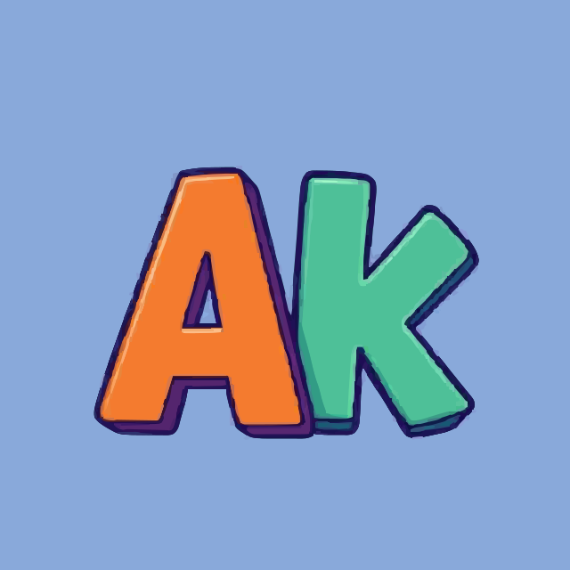

# 💫 About Me:
🔭 I’m currently working on : Machine learning, Generative AI and cybersecurity 👯 I’m looking to collaborate on : Hackathon Teams and research projects 🤝 I’m looking for help with : Learning all things AI and cybersecurity 🌱 I’m currently learning : AI architectures, DSA and cybersecurity algorithms 💬 Ask me about : How the world works🤪 ⚡ Fun fact : I won a hackathon with just 1 day experience in coding.

## 🌐 Socials:
<a href="https://www.linkedin.com/in/amogh-kalasapura" target="_blank"></a> 

# 💻 Tech Stack:
                                               
# 📊 GitHub Stats:
 
 

### ✍️ Fav Dev Quote
“Sometimes it pays to stay in bed on Monday rather than spending the rest of the week debugging Monday’s code.” - Dan Salomon

### 🔝 Top Contributed Repo

---

<!-- Proudly created with GPRM ( https://gprm.itsvg.in ) -->
